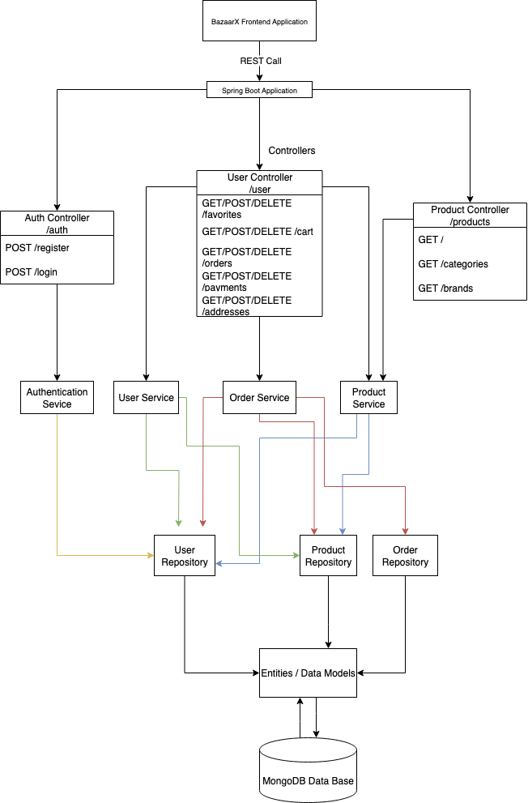

#  BazaarX Backend

Welcome to the backend of **BazaarX**, a modern e-commerce platform.  
This RESTful API is built using **Spring Boot** and **MongoDB**, designed to handle user authentication, product listings, and order management.

---

##  Project Structure

This backend is divided into the following main services:

- **Auth Service**: Handles user registration, login, JWT-based authentication.
- **User Service**: Manages user profiles, addresses, carts, favorites, and payments.
- **Product Service**: CRUD operations for product listings.
- **Order Service**: Order creation, and viewing.

---

##  Tech Stack

- Java 17
- Spring Boot 3
- Spring Web
- Spring Data MongoDB
- Spring Security + JWT
- Lombok
- Maven

---

##  Architecture Diagram

---

## 🚀 Deployment

The backend is deployed on **Render**.  
Visit the live API here: [https://bazaarx-api.onrender.com](https://bazaarx-api.onrender.com)

---